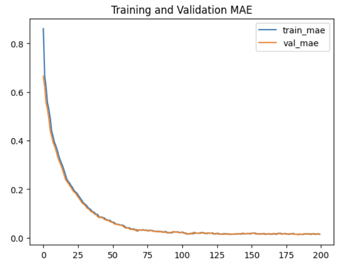
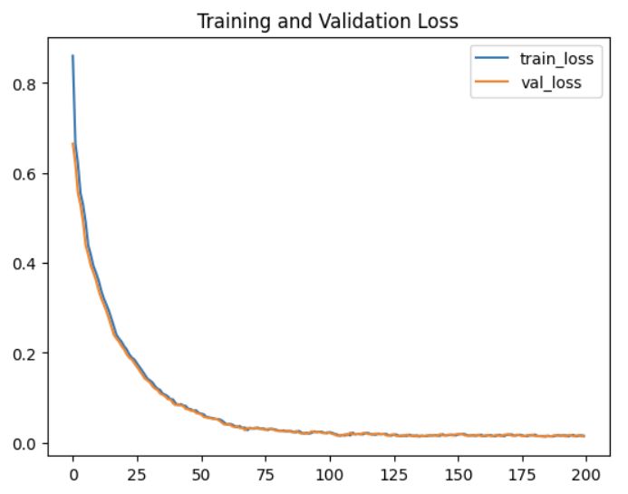
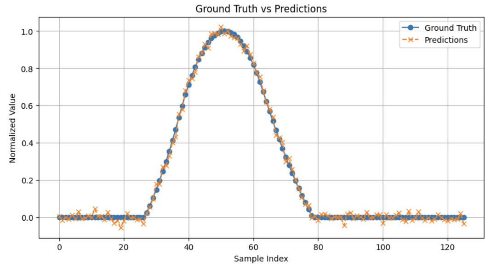
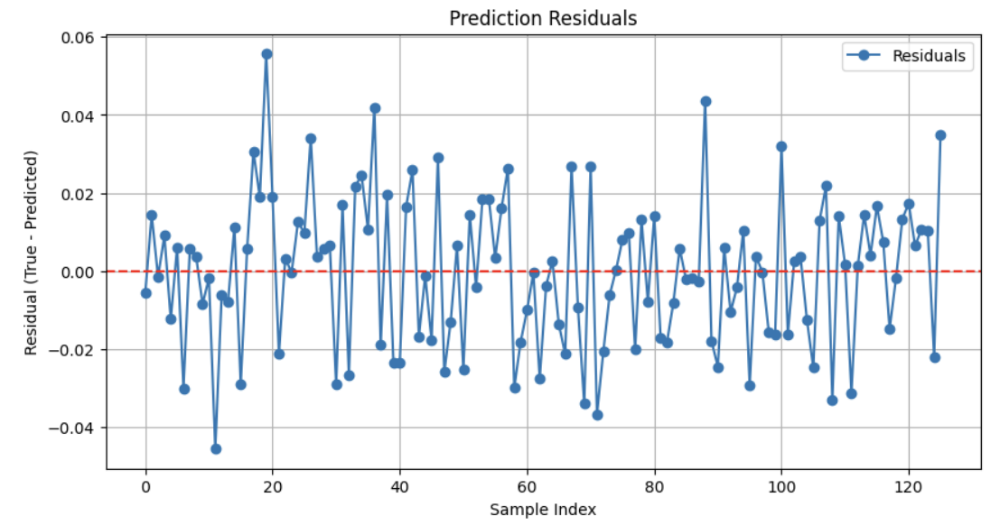

# Automated Cardiac Motion Analysis using ViViT

This repository implements a regression-based adaptation of the Video Vision Transformer (ViViT) for automated cardiac motion analysis. Our goal is to predict continuous physiological curves from cine myocardial mask video sequences, thereby offering a non-invasive and efficient tool for cardiac function assessment.

---

## Overview

Cardiac motion analysis is critical for accurate diagnosis and monitoring of heart function. Traditional methods—such as manual interpretation of MRI or echocardiography—are labor-intensive, subjective, and prone to variability. Recent advances in deep learning, especially transformer-based architectures, have enabled automated, quantitative analyses of video data.

This project adapts the original ViViT model (designed for video classification) for regression tasks. By leveraging global spatio-temporal attention, the model effectively learns to map preprocessed cardiac videos to continuous physiological signals.

---

## Background

### Cardiac Motion Analysis

- **Clinical Importance:**  
  Evaluating cardiac function (e.g., ejection fraction, myocardial strain) is essential for diagnosing heart conditions and planning treatments.
  
- **Limitations of Traditional Methods:**  
  Manual image interpretation is not only time-consuming but also subject to inter-observer variability.
  
- **Automation Potential:**  
  Deep learning techniques promise improved speed, objectivity, and reproducibility in cardiac assessments.

### Vision Transformers & the ViViT Model

- **Transformers in Vision:**  
  Originally designed for NLP, transformers use multi-head self-attention to capture long-range dependencies. This property is especially advantageous in video processing, where spatial and temporal features are both crucial.

- **ViViT Architecture:**  
  The ViViT model extends the Vision Transformer (ViT) to video by tokenizing both spatial and temporal dimensions and processing them jointly. Key innovations include:
  - **Spatio-Temporal Tokenization:**  
    Frames are divided into patches (or tubelets) that are embedded into tokens.
  - **Global Attention:**  
    The transformer encoder processes the entire sequence of tokens from the video, allowing it to model complex dynamics.
  - **Efficiency Variants:**  
    The original work also explores factorized approaches to reduce the quadratic complexity of self-attention.

For an in-depth understanding, please refer to the original [ViViT Paper](./ViViT_Paper.pdf).

### Our Adaptation

Our adaptation leverages the ViViT architecture for regression rather than classification. The accompanying paper, [Automated Cardiac Motion Analysis Using ViViT: A Regression Approach for Predicting Physiological Parameters](./ViViT_Cardiac_Motion_Analysis.pdf), details the modifications and experimental outcomes.

---

## Methodology

### Data Preprocessing

- **Input Data:**  
  A NumPy file (`2023-11-15-cine-myo-masks-and-TOS.npy`) contains:
  - Cropped cine myocardial masks (dimensions: T × H × W).
  - Corresponding target time-series curves (TOS) representing physiological signals.

- **Normalization & Standardization:**  
  - **Masks:** Pixel values are normalized to the [0, 1] range.
  - **Targets:** Min–max normalization is applied to the TOS curves.

- **Resizing & Temporal Alignment:**  
  - Each frame is resized (e.g., to 32×32 pixels).
  - Videos are padded or truncated to a fixed number of frames (64) to maintain uniformity.

### Model Architecture

Our ViViT-based regression model consists of four primary components:

1. **Patch Embedding:**  
   - Each video frame is divided into non-overlapping patches (16×16 pixels).  
   - Patches are linearly projected into a lower-dimensional embedding space.

2. **Positional Embedding:**  
   - A learnable positional embedding (including a classification token) is added to the token sequence.  
   - This step preserves the spatial and temporal order essential for video data.

3. **Transformer Encoder Blocks:**  
   - A stack of transformer encoder layers (each with multi-head self-attention and MLP sub-layers) processes the spatio-temporal tokens.
   - The encoder captures global dependencies across the entire video.

4. **Regression Head:**  
   - The output of the classification token is passed through a dense layer to predict the continuous physiological signal.

### Training Setup

- **Optimizer & Loss:**  
  - Adam optimizer with a learning rate of 1e-4.
  - Mean Absolute Error (MAE) is used as both the loss function and the performance metric.
  
- **Hyperparameters:**  
  - **Epochs:** 200  
  - **Batch Size:** 4  
  - **Regularization:** Dropout (0.1) is applied within the attention and MLP layers to mitigate overfitting.

---

## Experimental Results

### Training Dynamics
- **Convergence:**  
  - The training and validation loss curves (see `training_validation_loss.png`) demonstrate a rapid decrease within the first 50 epochs and stabilize well before 200 epochs.
  - MAE curves (see `training_validation_mae.png`) indicate that both training and validation MAE fall below 0.1 around epoch 50, eventually approaching 0.015 by the end of training.

### Model Performance Metrics
- **Final Evaluation Scores on Validation Set:**  
  - **Validation MAE:** 0.0154  
  - **Percent Error:** 6.51%  
  - **R² Score:** 1.00  
  - **Relative Accuracy:** 93.49%

### Visualizations

- **Training & Validation MAE:**

  

- **Training & Validation Loss:**

  

- **Sample Prediction Visualizations:**  
  The visualizations below illustrate comparisons between ground truth and predicted signals, as well as residual plots.

    
    

---

## Usage

### Installation

Ensure you have Python 3.8 or higher installed. Then, install the required packages:
```bash
pip install tensorflow numpy matplotlib
```

### Running Training

To train the model, execute:
```bash
python scripts/train.py
```
This script will:
- Load the preprocessed dataset.
- Build and compile the ViViT model.
- Train the model for 200 epochs while logging training and validation performance.
- Save output graphs (e.g., `training_validation_mae.png`, `training_validation_loss.png`) to the `outputs/` directory.

### Evaluating the Model

After training, run the evaluation script:
```bash
python scripts/evaluate.py
```
This script:
- Loads a validation batch.
- Generates predictions.
- Plots the ground truth versus predictions along with residuals.
- Computes additional metrics (percent error, R², relative accuracy).

---

## References

- **ViViT: A Video Vision Transformer**  
  Anurag Arnab, Mostafa Dehghani, et al. (2021).  
  [ViViT Paper](./ViViT_Paper.pdf)

- **Automated Cardiac Motion Analysis Using ViViT: A Regression Approach for Predicting Physiological Parameters**  
  Joseph Cohen (2024).  
  [Automated Cardiac Motion Analysis Using ViViT: A Regression Approach for Predicting Physiological Parameters](./ViViT_Cardiac_Motion_Analysis.pdf)
